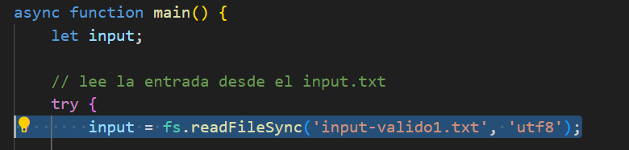
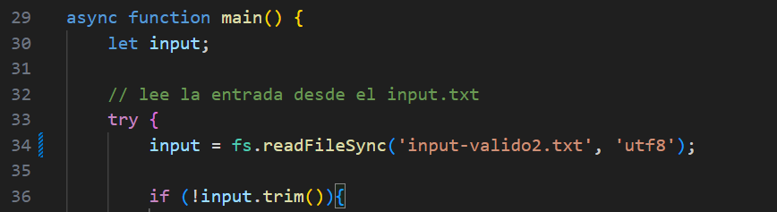
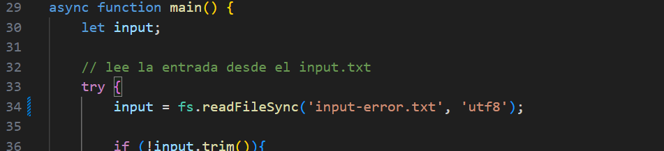
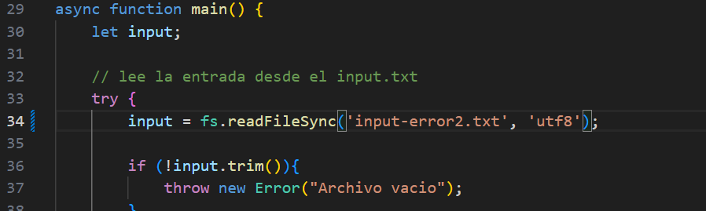

# Analizador DSL - Segurate

Este proyecto implementa un analizador léxico, sintáctico y semántico para un lenguaje específico (`DSL`) basado en condiciones de seguridad y comandos asociados.

El proyecto está desarrollado usando:
- [ANTLR](https://www.antlr.org/ ) para definir la gramática
- JavaScript + Node.js para el análisis
- Visitor y Listener personalizados para interpretar las reglas
- Salida estructurada: tabla de tokens, árbol sintáctico, reglas recolectadas y exportación a JSON

---
Para ver el funcionamiento con los 4 archivos de ejemplos, debo ir al archivo index.js. Luego ir a la funcion async function main() , y en la linea numero 34 modificar el nombre del archivo txt por el correspondiente que se quiera ejectuar. 

